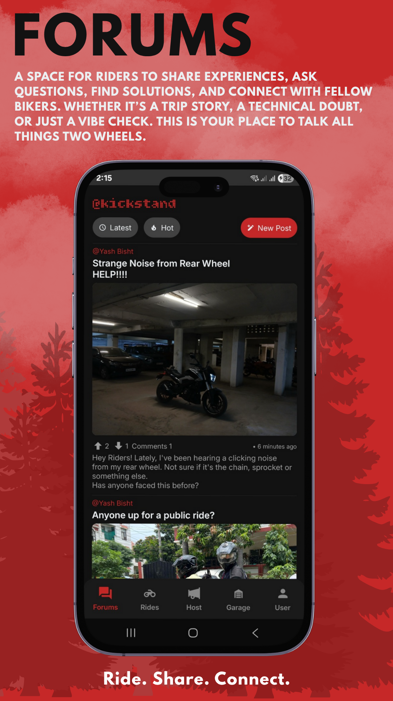
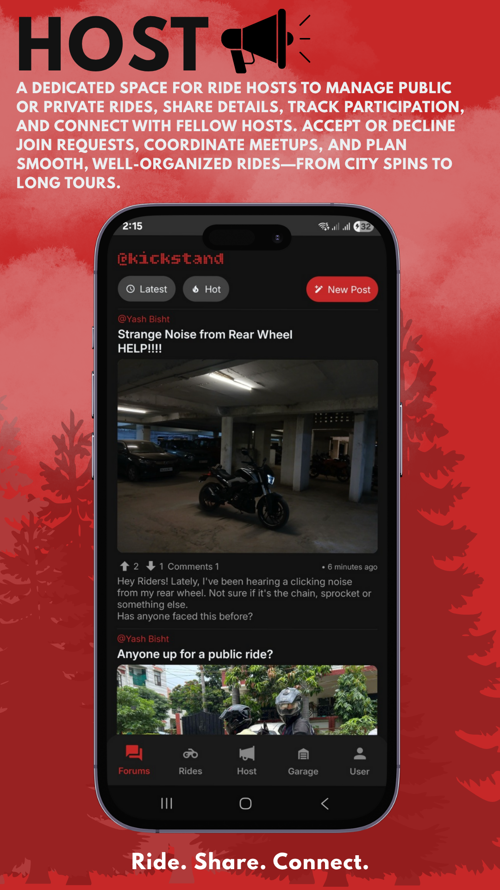

Kickstand

## Acknowledgements
# 🏍️ Kickstand

**Kickstand** is a React Native app for motorcycle enthusiasts to manage rides, track vehicle expenses, connect with other riders, and share experiences.  
Whether you’re a solo rider or part of a crew, Kickstand makes planning and connecting easier.

---

## 🚀 Features

### 🛠 Management
- Track **vehicle anagement**,**expenses**, and **service history**

### 🗺 Navigation & Rides
- **Create** or **join rides** (public or private)
- Accept/decline **ride join requests**
- Coordinate meetups and share ride details

### 📢 Community
- Post and engage with other riders
- Share trip experiences and updates

### 👤 User Profile
- Manage personal details
- View and edit ride history
- Service centre reviews

## Soon on Playstore!!

## Screenshots

